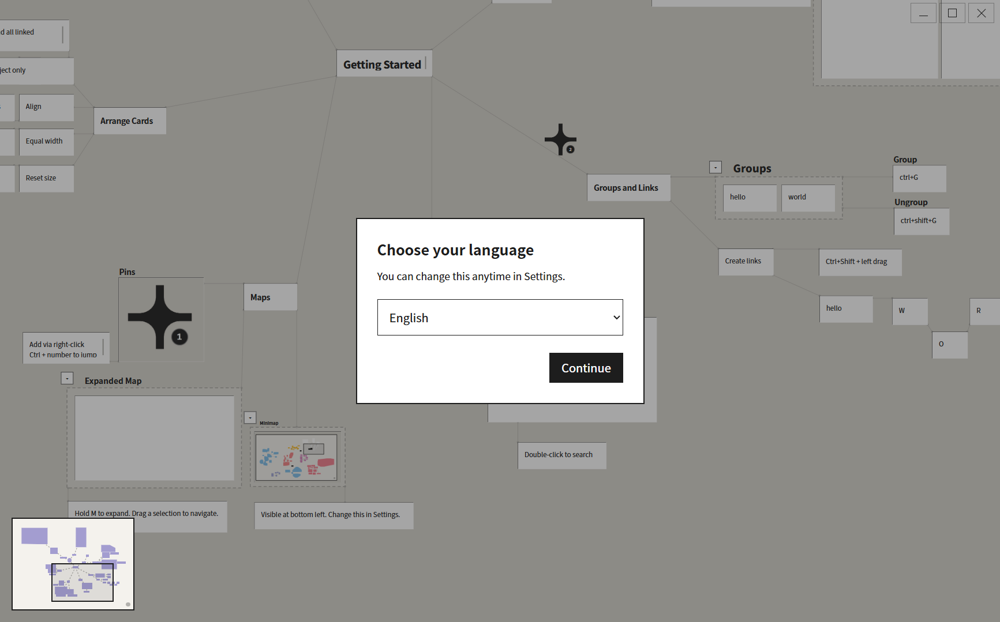

# Drop-It English

An infinite canvas for collecting text, images and web links. Turn things you want to remember into cards, then organize them into a visual knowledge map.

## Download

Windows 10/11 releases are available on [GitHub Releases](https://github.com/lalala625k-ops/Drop-It-English/releases).

- **Portable:** extract `Drop-It-English-0.1-Portable.zip` and run `DropIt.exe`.
- **Installer:** run `Drop-It-English-Setup-0.1.exe`. Installation is per user and creates desktop and Start menu shortcuts.

Both editions require Microsoft Edge WebView2 Runtime. Python and Node.js are not needed. Keep the portable folder intact.

On first use, the app opens **Template English.drop** and asks for your language. **English is the default**; Chinese is also available. The choice is remembered across restarts and new boards. Change it anytime with **Settings → Language**. Changing language does not translate or modify your own cards.



## Features

- Web cards with source links, page titles and cover images.
- Editable text cards with Markdown, floating titles, tags and dates.
- Drag or paste images, text and links, including expanded Pinterest images.
- Groups, origins and tree links for organizing related content.
- Copy and cut mixed selections across boards while retaining titles, formatting and internal links.
- Search, numbered pins, a minimap and canvas fit.
- `.drop` files, automatic drafts and recovery history.

The English edition retains the original canvas interactions, shortcuts and parsing rules.

## Essential controls

| Action | Default control |
|---|---|
| Pan | Space/Alt + left drag, or middle drag |
| Zoom | Mouse wheel |
| Select | Left drag on empty canvas; Shift adds to selection |
| New card / origin | Ctrl+N / Ctrl+J |
| Copy / cut / paste | Ctrl+C / Ctrl+X / Ctrl+V |
| Place pasted objects | Click to place; Escape cancels |
| Group / ungroup | Ctrl+G / Ctrl+Shift+G |
| Link objects | Ctrl+Shift + left drag |
| Search | Ctrl+K or double-click empty canvas |
| Pins | Right-click to add; Ctrl+1–8 to jump |
| Expanded minimap | Hold M |
| Fit canvas | Shift+1 |
| Save / Save As | Ctrl+S / Ctrl+Shift+S |
| Settings | Ctrl+, |
| Reload | F5 |

The Settings shortcut catalog contains all current controls, grouped into Navigation, Cards, Groups, Layout, Workspace and Editing.

## Files and privacy

The app creates these folders beside its executable, or beside the source project in development:

```text
Files/
├── Template/     Template English.drop — the only shipped example
├── Save/         Manually saved boards
└── Temporary/    Automatic drafts and recovery records
```

Open initially starts in `Files/Template`; the first Save starts in `Files/Save`. Settings can change the save and draft folders. Move the entire `Files` folder with a portable app.

Runtime databases, images and language preference use `%LOCALAPPDATA%\DropItEnglish`, separately from the original Chinese edition. Uninstall preserves user files and runtime data. Back up your boards before updating.

This repository contains only the designated English template. Personal boards, databases, credentials, logs, recovery records and generated binaries are excluded from Git. Service credentials must be stored in ignored `.local.json`, `.local.csv` or `.env` files. Optional image source recognition requires the user to configure their own service; no credentials are bundled.

`SHA256SUMS.txt` lists the release archive and installer checksums. You can verify a download with `Get-FileHash -Algorithm SHA256 <file>`.

## Run from source

Install Python, Node.js and Microsoft Edge WebView2 Runtime, then run:

```powershell
python -m pip install -r backend/requirements-desktop.txt
npm --prefix frontend ci
npm run desktop:start
```

`Start Desktop.bat` starts the desktop app. `npm run dev` runs the WebView2 development shell with Vite hot reload. `npm run build` builds the frontend; `open_site.bat` starts local browser mode.

To build Windows distributions, install the dependencies in `backend/requirements-desktop.txt`, PyInstaller, 7-Zip and NSIS, then run `npm run desktop:dist`. Set `PINBOARD_MAKENSIS` to a portable NSIS compiler if it is not installed on PATH. Outputs are under `release/`. `Open Portable.bat` opens the latest portable folder.

## Tests

```powershell
npm --prefix frontend run test:language
npm --prefix frontend run test:clipboard
npm --prefix frontend run test:menus
npm --prefix frontend run test:pinterest
python -m unittest discover -s backend/tests
python -m unittest discover -s desktop/tests
```

## Documentation

- [Product behavior](product_requirements_document.md)
- [Architecture](ARCHITECTURE.md)
- [Desktop and release guide](DESKTOP_SPEC.md)
- [Visual design](DESIGN_SPEC.md)
- [Settings and shortcuts](SETTINGS_NAMES.md)
- [Protected parsing rules](image_parsing_rules.md) — original registry retained for maintainers.

Source code is licensed under [MIT](LICENSE). Third-party dependencies and external content shown in the example retain their respective licenses and rights.
